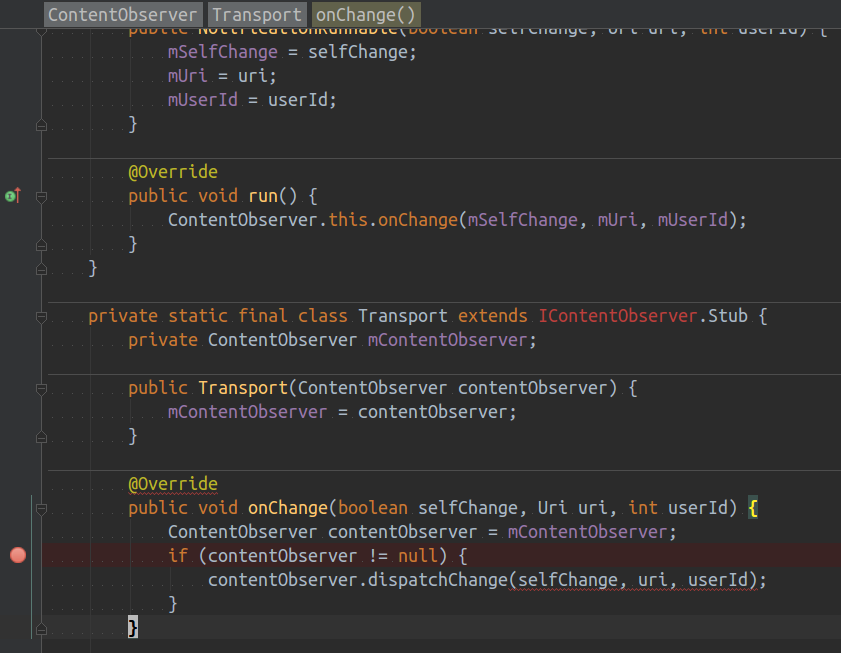
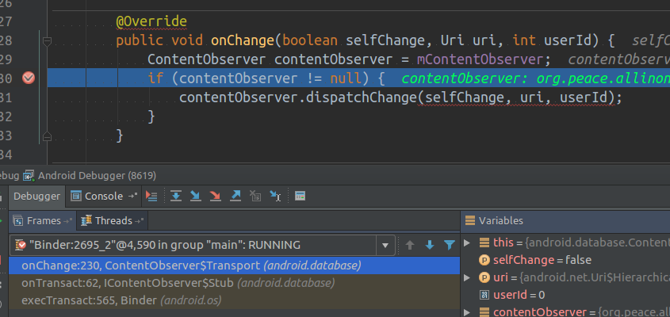

### Reproduce Steps  

1. Open the demo app 
2. Turn on and turn off auto brightness mode by the notification bar shortcut
3. Check the log output, and make sure the onChange method is called.
4. Add a break point in the ContentObserver#Transport#onChange as following. 
 
5. Attatch the debuger to the process: org.peace.allinone
6. Change the brightness mode once, so the process break in the break point as following.

7. At this point, the binder thread hangs there, but the main thread is fine. 
8. Click the "Unregister Content Observer" button in the demo.
9. Check the log output, and see the log "unregister finished" shows.
10. Resume the program hanged by debugger, and check the log, the onChange is called still.